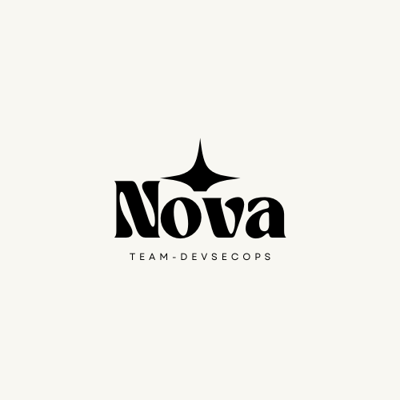

# 프로젝트 Nova


## 프로젝트 개요
DevSecOps 방법론을 적용한 웹 애플리케이션 개발 및 운영 환경 구축 프로젝트입니다. 
보안을 고려한 CI/CD 파이프라인과 모니터링 시스템을 구축하여 안전하고 효율적인 개발 환경을 제공합니다.

## 기술 스택
- **컨테이너 오케스트레이션**: Kubernetes (Kind)
- **CI/CD**: Jenkins
- **웹 서비스**: Apache, PHP
- **버전 관리**: Git, GitHub

## 프로젝트 구조
```
📁 Nova
├── 🔍 ELK/                                    # Elasticsearch, Logstash, Kibana 스택
│   └── 📦 k8s/                                # ELK 스택 Kubernetes 매니페스트
│       ├── ⚙️ elasticsearch.yaml              # Elasticsearch 설정
│       ├── ⚙️ kibana.yaml                     # Kibana 설정
│       ├── ⚙️ logstash.yaml                   # Logstash 설정
│       ├── 🐋 docker-compose.yml              # ELK 스택 Docker Compose 설정
│       └── ⚙️ logstash.conf                   # Logstash 파이프라인 설정
│       
├── 🔧 Jenkins/                                # Jenkins CI/CD 서버
│   └── 📦 k8s/                                # Jenkins Kubernetes 매니페스트
│       ├── ⚙️ jenkins-deployment.yaml         # Jenkins 배포 설정
│       ├── ⚙️ jenkins-pv.yaml                 # Jenkins 영구 볼륨 설정
│       ├── ⚙️ ngrok-secret.yaml               # Jenkins ngrok 연동 설정
│       ├── ⚙️ jenkins-service.yaml            # Jenkins 서비스 설정
│       ├── ⚙️ network-policy.yaml
│       ├── ⚙️ serviceaccount.yaml
│       ├── ⚙️ role.yaml
│       ├── ⚙️ rolebinding.yaml 
│       ├── ⚙️ clusterrole.yaml
│       ├── ⚙️ clusterrolebinding.yaml
│       ├── ⚙️ postgres-deployment.yaml
│       ├── ⚙️ sonarqube-deployment.yaml
│       └── ⚙️ services.yaml
│       
├── ☸️ Kubernetes/                             # Kubernetes 클러스터 설정
│   └── ⚙️ kind-config.yaml                    # Kind 클러스터 설정
│   
└── 🎯 web_wargamer/                           # 워게임 웹 애플리케이션
    ├── 💾 backup/                             # 백업 디렉토리
    ├── 📦 k8s/                                # Kubernetes 매니페스트
    │   ├── ⚙️ db-deployment.yaml              # 데이터베이스 배포 설정
    │   ├── ⚙️ db-init-configmap.yaml          # DB 초기화 ConfigMap
    │   ├── ⚙️ services.yaml                   # 서비스 설정
    │   └── ⚙️ web-deployment.yaml             # 웹 애플리케이션 배포 설정
    ├── 🌐 web/                                # 웹 애플리케이션 소스 코드
    ├── 🐳 Dockerfile                          # 웹 애플리케이션 도커 이미지 설정
    └── 📄 .gitignore                          # Git 무시 파일 설정
```

## 컴포넌트 설명

### 1. Kubernetes 클러스터 (/Kubernetes)
- Kind를 사용한 로컬 Kubernetes 클러스터 구성
- 워커 노드별 역할 분리 (웹서버, Jenkins, ELK 스택 등)
- 자동화된 클러스터 생성 및 초기화 스크립트 제공

### 2. Jenkins CI/CD (/Jenkins)
- 자동화된 빌드 및 배포 파이프라인
- GitHub 웹훅을 통한 자동 빌드 트리거
- Kubernetes 매니페스트를 통한 컨테이너화된 Jenkins 배포
- 보안 취약점 스캔 및 코드 품질 검사 통합

### 3. 웹 애플리케이션 (/Web)
- Apache와 PHP 기반의 웹 서비스
- Kubernetes에 최적화된 컨테이너 구성
- 보안 강화를 위한 설정 적용
- 자동 스케일링 지원

## 시작하기

### 사전 요구사항
- Docker Desktop
- Git
- Windows 운영체제

### 설치 및 실행
1. 클러스터 초기화:
```bash
cd Kubernetes
.\reset-cluster.bat
```

2. 클러스터 생성:
```bash
.\deploy.bat
```

3. Jenkins 배포:
```bash
cd ..\Jenkins
.\jenkins-service.bat
```

4. 웹 서비스 배포:
```bash
cd ..\Web
.\web-service.bat
```

## 접속 정보
- Jenkins: http://localhost:8080
- Sonarqube: http://localhost:30900
- Kibana: http://localhost:5601
- 웹 서비스: http://localhost:30080

## 보안 검사
1. Jenkins 파이프라인에서 자동으로 SonarQube 정적 분석 수행
2. 코드 품질 및 보안 취약점 리포트 생성
3. 품질 게이트 기준에 따른 배포 승인/거부

## 참고 자료
- Kubernetes: https://kubernetes.io/
- Jenkins: https://www.jenkins.io/
- SonarQube: https://www.sonarqube.org/
- Apache: https://httpd.apache.org/